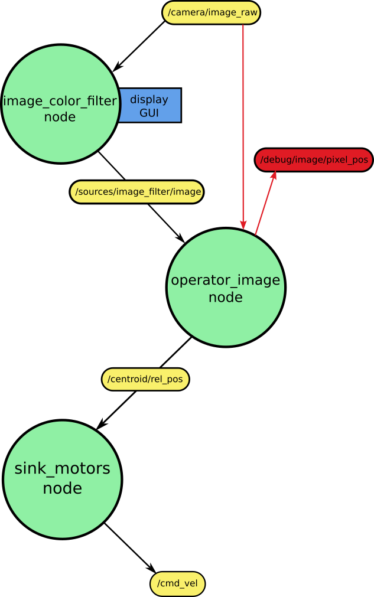

# Requirements

ROS2 foxy installed on both the robot and the computer
OpenCV library installed on both the robot and the computer.
cv_bridge library installed on both the robot and the computer.

# Simulation

Here we can see a scheme of the nodes and the data flow or the communications between them using topics:



To execute this, you will need first to have an instance of gazebo running with a robot or something that publishes an image in the topic "/camera/raw_image" e.g. a turtlebot3 waffle model.

You can launch rviz2 too to see the images and debug information.

Once these steps have been done we could run the nodes one by one using the following commands:

Run the image filter node:
```
ros2 run follow_beacon image_color_filter --ros-args -p display_gui:=false
```

Run the centroid finder:
```
ros2 run follow_beacon operator_image
```

Run the velocity publisher:
```
ros2 run follow_beacon sink_motors
```

To adjust the color filter to make it find the color you want use the first command with the display_gui parameter to true, to display the color filter GUI and adjust the sliders (They represent a range of a HSV color space):
```
ros2 run follow_beacon image_color_filter --ros-args -p display_gui:=true
```

# Real robot

Here we can see a scheme of the nodes and the data flow or the communications between them using topics:


To execute this, you will need first to have the turtlebot3 burguer model with an USB camera (or you can use the waffle model) and the brigup running in the robot:
```
ros2 launch turtlebot3_bringup robot.launch.py
```

Run the image publisher in the robot (it isn't needed if your robot model already publishes the camera image on the topic /camera/image_raw):
```
ros2 run follow_beacon camera_image_pub --ros-args --params-file <your_ws>/src/follow_beacon/config/params.yaml
```

Run the image filter:
```
ros2 run follow_beacon image_color_filter --ros-args --params-file <your_ws>/src/follow_beacon/config/params.yaml
```

Run the centroid finder:
```
ros2 run follow_beacon operator_image --ros-args --params-file <your_ws>/src/follow_beacon/config/params.yaml
```

Run the velocity publisher:
```
ros2 run follow_beacon sink_motors --ros-args --params-file <your_ws>/src/follow_beacon/config/params.yaml
```

If you want to change the parameters modify the [config/params.yaml](config/params.yaml) file.
